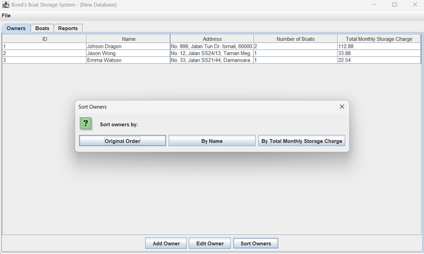
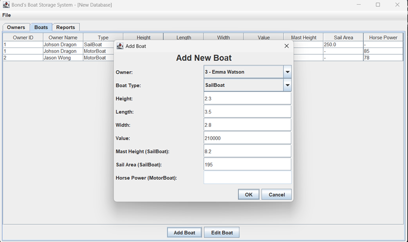
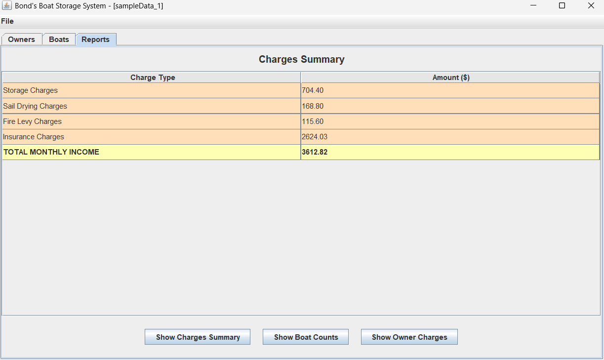
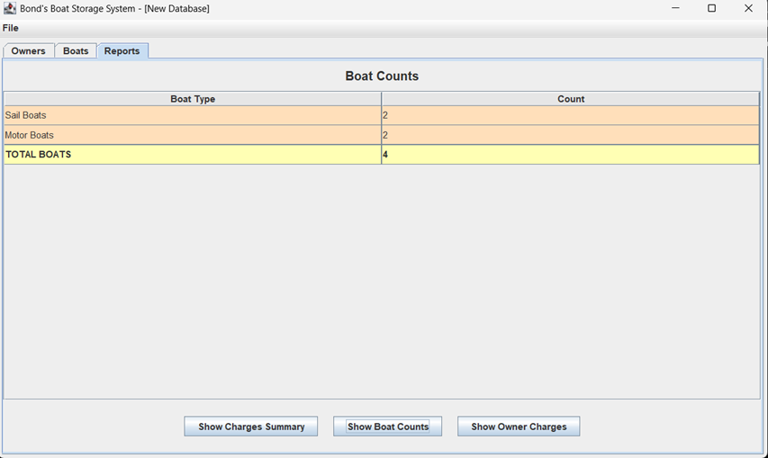
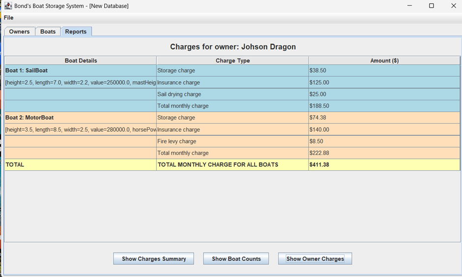

# Boat Storage Management System

## Project Overview





**Boat Storage Management System** is a Java Swing-based GUI application that manages boat storage facilities on the north side of Pulau Langkawi. The system handles boat owners, sailboats, and motorboats, automatically calculating monthly storage charges, levies, and generating comprehensive reports.

This application demonstrates key object-oriented programming principles including:
- **Inheritance** (abstract Boat class with SailBoat and MotorBoat subclasses)
- **Encapsulation** (private fields with getters/setters)
- **Abstraction** (abstract methods for charge calculations)
- **Collections** (ArrayList for managing owners and boats)
- **Serialization** (persistent data storage)
- **GUI Design** (Swing components with tabbed interface)

---

## System Features

### 1. Owner Management
- **Add Owner**: Create new boat owners with unique sequential ID numbers (starting from 1)
  - Owner attributes: ID Number, Name, Address
  - ID numbers auto-increment automatically
- **Edit Owner**: Modify existing owner information
- **View Owners**: Display all owners in a sortable table
- **Sort Owners**: Three sorting options:
  - Original order (order added)
  - Alphabetical by name
  - By total monthly storage charges (descending)

### 2. Boat Management
- **Add Boat**: Register new boats for existing owners
  - Choose boat type: **SailBoat** or **MotorBoat**
  - Each boat is linked to an owner
  
  **SailBoat Attributes:**
  - Height, Width, Length (in meters)
  - Boat Value (in currency)
  - Mast Height (in meters)
  - Sail Area (in square meters)
  
  **MotorBoat Attributes:**
  - Height, Width, Length (in meters)
  - Boat Value (in currency)
  - Horsepower (integer value)

- **Edit Boat**: Update boat information for any owner
- **View Boats**: Display all boats with owner information in a table

### 3. Reports and Analytics
The system provides 3 comprehensive report types:

**Charges Summary Report:**
- Total Storage Charges across all boats
- Total Sail Drying Charges (sailboats only)
- Total Fire Levy Charges (motorboats only)
- Total Insurance Levies (all boats)

**Boat Counts Report:**
- Number of SailBoats in storage
- Number of MotorBoats in storage
- Total boats in storage

**Owner Charges Report:**
- Detailed per-owner breakdown showing:
  - Owner ID and Name
  - Storage Charges
  - Sail Drying Charges (if applicable)
  - Fire Levy Charges (if applicable)
  - Insurance Levies
  - Total Monthly Charge

### 4. Data Persistence
- **Save Database**: Save current data to file using Java serialization
- **Save As**: Save database to a new file location
- **Load Database**: Load previously saved database from file
- File format: Serialized Java objects (.dat or custom extension)

---

## Charge Calculation Formulas

| Charge Type | Formula | Applies To | Rate |
|------------|---------|------------|------|
| **Storage Charge** | `height × length × width × chargeRate` | All boats | chargeRate = 1.0 per m³ |
| **Insurance Levy** | `boatValue × 0.0005` | All boats | 0.05% of boat value per month |
| **Sail Drying Charge** | `sailArea × 0.10` | SailBoats only | 10% per m² of sail area |
| **Fire Levy Charge** | `horsePower × 0.10` | MotorBoats only | 10% per horsepower unit |

### Example Calculations:

**SailBoat:**
- Volume: 2m (H) × 5m (L) × 3m (W) = 30 m³
- Storage Charge: 30 × 1.0 = **$30.00**
- Sail Drying: 50 m² × 0.10 = **$5.00**
- Insurance Levy: $50,000 × 0.0005 = **$25.00**
- **Total Monthly Charge: $60.00**

**MotorBoat:**
- Volume: 1.5m (H) × 6m (L) × 2.5m (W) = 22.5 m³
- Storage Charge: 22.5 × 1.0 = **$22.50**
- Fire Levy: 250 HP × 0.10 = **$25.00**
- Insurance Levy: $75,000 × 0.0005 = **$37.50**
- **Total Monthly Charge: $85.00**

---

## Class Structure

### Core Classes

#### **Boat (Abstract Class)**
```
Attributes:
- height: double (boat height in meters)
- length: double (boat length in meters)
- width: double (boat width in meters)
- boatValue: double (monetary value)
- chargeRate: static double = 1.0 (storage rate per m³)
- levyRate: static double = 0.0005 (insurance rate)

Methods:
+ storageCharge(): double
+ insuranceLevy(): double
+ totalMonthlyCharge(): abstract double
+ getters/setters for all attributes
```

#### **SailBoat (extends Boat)**
```
Attributes:
- mastHeight: double (height of mast in meters)
- sailArea: double (sail area in square meters)
- sailRate: static double = 0.10

Methods:
+ sailDryingCharge(): double
+ totalMonthlyCharge(): double (override)
  = storageCharge() + insuranceLevy() + sailDryingCharge()
+ getters/setters for sailboat-specific attributes
```

#### **MotorBoat (extends Boat)**
```
Attributes:
- horsePower: int (engine horsepower)
- fireRate: static double = 0.10

Methods:
+ fireLevyCharge(): double
+ totalMonthlyCharge(): double (override)
  = storageCharge() + insuranceLevy() + fireLevyCharge()
+ getters/setters for motorboat-specific attributes
```

#### **Owner**
```
Attributes:
- idNumber: String (unique owner ID)
- name: String (owner name)
- address: String (owner address)
- boats: ArrayList<Boat> (list of owned boats)

Methods:
+ addBoat(Boat): void
+ totalOwnerCharge(): double (sum of all boats' charges)
+ totalStorageCharge(): double (sum of storage charges only)
+ getters/setters for all attributes
```

#### **BoatStorage**
```
Attributes:
- owners: ArrayList<Owner>
- boats: ArrayList<Boat>

Methods:
+ addOwner(Owner): void
+ addBoat(Boat, Owner): void
+ findOwner(String): Owner
+ countSailBoats(): int
+ countMotorBoats(): int
+ getTotalBoatCount(): int
+ getTotalStorageCharges(): double
+ getTotalInsuranceLevies(): double
+ getTotalSailDryingCharges(): double
+ getTotalFireLevyCharges(): double
+ getOwners(): ArrayList<Owner>
+ getOwnersSortedByName(): ArrayList<Owner>
+ getOwnersSortedByStorageCharges(): ArrayList<Owner>
+ displayChargeSummary(): void
```

### GUI Classes

#### **BoatStorageGUI**
- Main application window (JFrame)
- Manages tabbed interface (Owners, Boats, Reports)
- Handles file operations (Save, Load)
- Coordinates dialogs and data refreshing
- Manages owner ID counter for unique IDs

#### **OwnerTabPanel**
- Displays owners in a JTable
- Buttons: Add Owner, Edit Owner, Sort Owners
- Uses OwnerTableModel for data display

#### **BoatTabPanel**
- Displays boats with owner information in a JTable
- Buttons: Add Boat, Edit Boat
- Uses BoatTableModel for data display

#### **ReportTabPanel**
- Displays three types of reports:
  - Charges Summary (default)
  - Boat Counts
  - Owner Charges
- Read-only tables with custom styling
- Uses specialized table models for each report type

#### **OwnerDialog**
- Modal dialog for adding/editing owners
- Input validation for all fields
- Handles both new owner creation and editing

#### **BoatDialog**
- Modal dialog for adding/editing boats
- Owner selection dropdown
- Boat type selection (SailBoat/MotorBoat)
- Dynamic field visibility based on boat type
- Input validation for all numeric fields

### Table Model Classes

- **OwnerTableModel**: Displays owner data with boat count and total charges
- **BoatTableModel**: Displays boats with owner, type, dimensions, and charges
- **ReportSummaryChargesTableModel**: Shows total charges breakdown
- **ReportCountsTableModel**: Shows boat type counts
- **ReportOwnerChargesTableModel**: Shows detailed per-owner charges

---

## How to Run the Application

### Prerequisites
- Java Runtime Environment (JRE) 8 or higher
- Java Development Kit (JDK) if compiling from source

### Running the Application

#### Option 1: Using the JAR file (Executable)
```bash
java -jar BoatStorageGUI.jar
```

#### Option 2: Double-Click
- Simply double-click `BoatStorageGUI.jar` (if Java file associations are configured)

#### Option 3: Compile and Run from Source
```bash
# Compile all Java files
javac assignment1/*.java

# Run the main class
java assignment1.BoatStorageGUI
```

---

## User Interface Guide

### Main Window
- **Menu Bar**: File menu with Save, Save As, Upload File, and Exit options
- **Tabbed Interface**: Three tabs for different functionality

### Owners Tab
1. View all owners in a table
2. Click "Add Owner" to create a new owner
3. Select an owner and click "Edit Owner" to modify
4. Click "Sort Owners" to choose sorting method

### Boats Tab
1. View all boats with owner information
2. Click "Add Boat" to register a new boat (requires at least one owner)
3. Select a boat and click "Edit Boat" to modify

### Reports Tab
- Automatically displays Charges Summary on tab switch
- Use buttons to switch between report types:
  - Summary of Charges
  - Boat Counts
  - Owner Charges
---

## Sample Usage Workflow 
*Refer UserManual.docx for full details*
1. **Launch Application**: Run `BoatStorageGUI.jar`
2. **Add First Owner**: 
   - Go to Owners tab
   - Click "Add Owner"
   - Enter: Name="John Smith", Address="123 Marina Drive"
   - Owner ID "1" assigned automatically
3. **Add SailBoat**:
   - Go to Boats tab
   - Click "Add Boat"
   - Select Owner: "John Smith"
   - Choose Type: "SailBoat"
   - Enter dimensions, value, mast height, and sail area
4. **Add MotorBoat**:
   - Click "Add Boat" again
   - Select Owner: "John Smith"
   - Choose Type: "MotorBoat"
   - Enter dimensions, value, and horsepower
5. **View Reports**:
   - Go to Reports tab
   - Review Charges Summary showing all totals
   - Switch to Boat Counts to see type breakdown
   - View Owner Charges for detailed per-owner analysis
6. **Save Database**:
   - File → Save As
   - Choose location and filename
   - Database saved with all data

---


## Technical Implementation Notes

### Design Patterns
- **MVC Pattern**: Separation of data (models), presentation (views/panels), and control logic
- **Observer Pattern**: Tab change listeners for automatic table refresh
- **Factory-like Approach**: Dialog creation for owners and boats

### Data Persistence
- Uses Java Serialization (`Serializable` interface)
- Saves both `BoatStorage` object and `ownerIdCounter`
- File format allows complete state restoration

### Input Validation
- All numeric fields validated before processing
- Empty field detection and error messages
- Owner existence check before adding boats

### Code Quality Features
- Comprehensive JavaDoc comments on all classes and methods
- Proper encapsulation with private fields
- Use of Java 8 Streams for collection operations
- Consistent naming conventions

---
## Version History

- **Version 2.0**: GUI implementation with tabbed interface, dialogs, and file persistence
- **Version 1.0**: Console-based implementation (Assignment 1)

 
